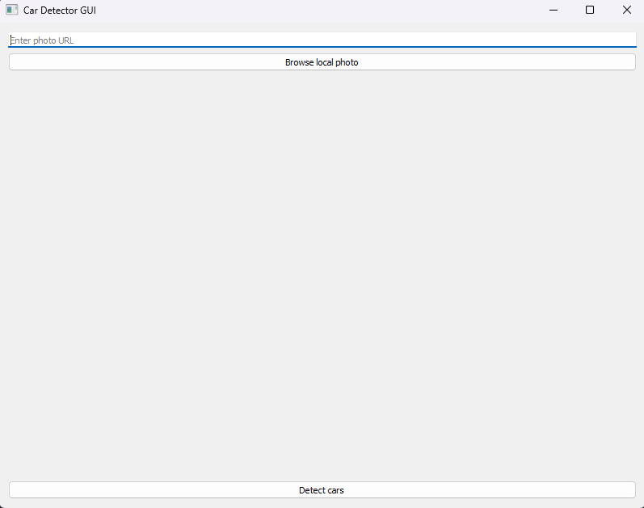
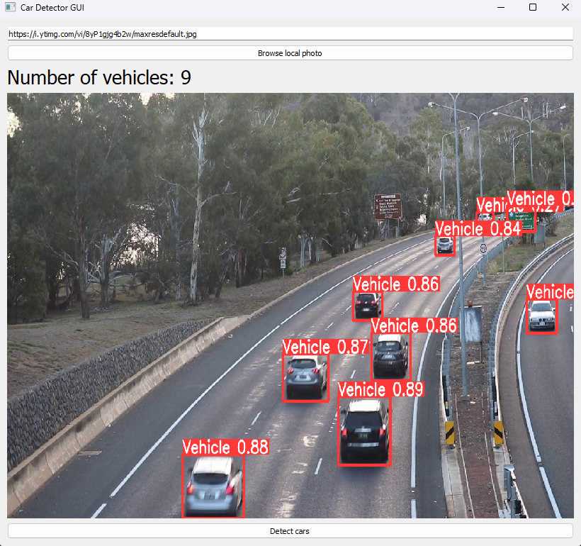
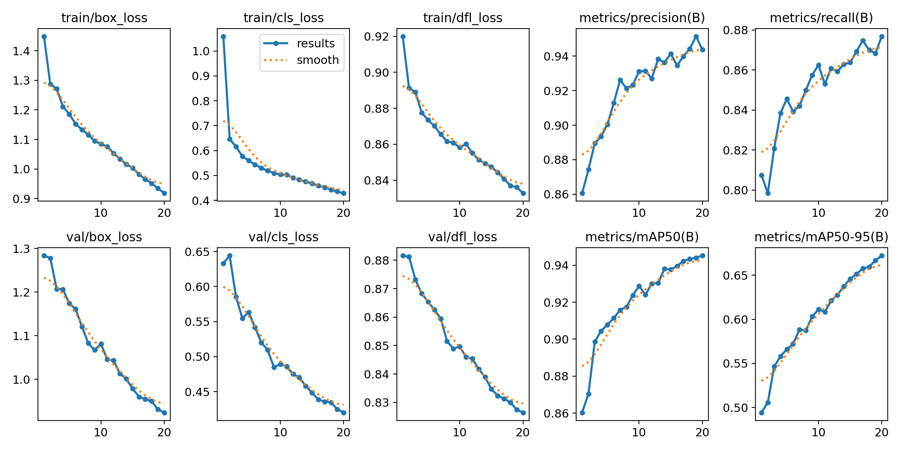

# vehicle-counting using ML

Vehicle detection and counting using fine-tuned YOLOv8 model

## Introduction

This project is a vehicle detection and counting system using a fine-tuned YOLOv8 model. The model is trained on the [Traffic Aerial Images](https://www.kaggle.com/datasets/javiersanchezsoriano/traffic-images-captured-from-uavs) dataset. The dataset contains 16.4k images of traffic captured from UAVs. The images are annotated with bounding boxes around the vehicles. The model is trained to detect and count vehicles in the images.

## Type of vehicles detected

Because of the nature of the dataset, the model is trained to detect vehicles in certain conditions. The model is trained to detect and count vehicles in moderate distance from the camera, in clear weather conditions, and in daylight. Images showing vehicles directly from above are not expected to be consistently detected.

## Usage

start the user interface by running:

```python
python gui.py
```

After the user interface is started you can select an image from your local files or specify a URL to an image.



Following the selection of an image, user can click on the "Detect" button to start the detection process. The detected vehicles will be shown in the image. The program should display the number of vehicles detected in the image as well as the annotated image.



## Thoughts about training

The biggest challenge was finding a suitable dataset for training. The dataset used in this project is not perfect. The images are captured from UAVs and the vehicles are in moderate distance from the camera. Vehicles that do not meet this criteria are not expected to be detected. Before I've stumbled upon this dataset I've tried to train the model using 2 different datasets ([dataset 1](https://www.kaggle.com/datasets/pkdarabi/vehicle-detection-image-dataset), [dataset 2](https://www.kaggle.com/datasets/farzadnekouei/top-view-vehicle-detection-image-dataset)).However I have found that those datasets are set in a really specific scenery and the model was not able to generalize well.

### Validation statistics



The model was trained for 20 epochs using a single 2060 RTX GPU. That took over 4.5 hours and as we can see on the validation statistics the model could have been trained for more epochs, but my PC was not happy :(.

### Data preprocessing

I have tried training the model using grayscale images (on the previous, smaller datasets), but the model was not able to detect vehicles consistently. The model was trained using the original images with the resolution of 1920x1080. The images were resized to 640px in width during training by YOLO internal tools.
